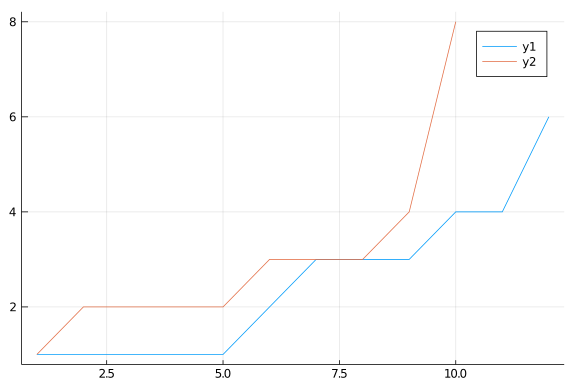

# Counting species and interactions

## Goals of this chapter

The goal of this chapter is to highlight the importance of thinking about the
number of interactions in a networks, and about the number of interactions
established by as species within a network. We will use various examples to
introduce the notions of connectance, degree, and linkage density. In addition,
this chapter will serve as an introduction to `EcologicalNetworks` and `Mangal`,
which will provide valuable information for the other chapters.

## Link-species relationships

We will begin this chapter by looking a basic information we can get on a single
network - this is useful both as an exploration of the concepts, and as an
introduction to the ways we can manipulate network data through programming. In
particular, this section will serve as a short introduction to the `Mangal`
package to download ecological networks dataset.

We will load the `Mangal` package, to get access to a variety of functions
allowing us to get network data from the [mangal.io](http://mangal.io) website.
Note that we will not load it with `using`, but with `import` - this means that
we will need to preface the name of the functions by `Mangal.`, to avoid having
a lot of functions with non-specific names in our namespace:

````julia
import Mangal
````


Finally, because we will want to make some visualisations, we will load the
packages for plots:

````julia
using Plots
````


All of these packages have documentations, and it is always a good idea to see
the different options available for the various functions. One way to get a
sense of the functions included in a package, or to get help on these functions,
it to type `?[PackageName].` in the Julia REPL, and to press Tab to see the
possible functions. This is also a great way to discover functionalities in
packages.

### Overview of the data querying

And with this, we are all set to get our first network from the <mangal.io>
database. To illustrate the basic notions, we will work on a pollination
network, which we access by its unique identifier (`935`). We will see in later
sections how we can get more control over what networks we get.

````julia
first_network = Mangal.network(935)
print(first_network.description)
````


````
Pollination networks of the Azorean Flores island
````


This object is of the type Mangal.MangalNetwork, and has information about
a network. To see what information is available in any type, we can call
`fieldnames` on the type. In this case, this would return

````julia
fieldnames(typeof(first_network))
````


````
(:id, :public, :name, :date, :position, :created, :updated, :user, :descrip
tion, :complete, :dataset)
````


Most of these information are metadata, *e.g.* the date, spatial position, date
of upload, and a reference. What we do *not* have is a list of the interactions.
Luckily, we do not yet need a list of interactions, since we are only concerned
with counting them (in due time, we will get the entire information on
interactions). The `Mangal` package has a method called `count`, which will
return the number of objects matching a series of queries. For example, we can
get the number of nodes (of type `MangalNode`) in our network with:

````julia
count(Mangal.MangalNode, first_network)
````


````
22
````


We can do the same with the number of interactions:

````julia
count(Mangal.MangalInteraction, first_network)
````


````
30
````


This method is preferable to more complex ones requiring to download all
interactions, because it is a lot faster. As we will see in the following
section, the representation of network data in <mangal.io> is very rich, and if
all we care about is counting things, then we do not need the overhead
associated with retrieving all the data.

Equipped with the ability to count objects, we can measure the number of species
and interactions in any network. We will now generalize this process a little
bit, and explore the relationship that exists between the number of species and
the number of links in a collection of networks.

### Getting the data for multiple networks

In <mangal.io>, networks are organized in datasets - we will work on a classical
food web analysis dataset, representing interactions in small lakes in the
Adirondack:

````julia
small_lakes_dataset = first(Mangal.datasets("q" => "Adirondack"))
````


````
Mangal.MangalDataset(15, true, "havens_1992", 2019-02-23T01:47:06, 2019-02-
23T01:47:06, Mangal.MangalReference(15, 1992, "10.1126/science.257.5073.110
7", missing, missing, "@article{Havens_1992, doi = {10.1126/science.257.507
3.1107}, url = {https://doi.org/10.1126%2Fscience.257.5073.1107}, year = 19
92, month = {aug}, publisher = {American Association for the Advancement of
 Science ({AAAS})}, volume = {257}, number = {5073}, pages = {1107--1109}, 
author = {K. Havens}, title = {Scale and Structure in Natural Food Webs}, j
ournal = {Science}}", "https://doi.org/10.1126%2Fscience.257.5073.1107", "U
RL of the attached data"), 3, "Pelagic communities of small lakes and ponds
 of the Adirondack")
````


To get the networks associated to this dataset, we can use the `networks`
function, which will give us an array of networks objects. But first, we may
want to know how many networks we will get this way:

````julia
count(Mangal.MangalNetwork, small_lakes_dataset)
````


````
50
````


The following line will get all of these networks for us:

````julia
small_lakes_networks = Mangal.networks(small_lakes_dataset)
println("small_lakes_networks contains $(length(small_lakes_networks)) networks")
````


````
small_lakes_networks contains 50 networks
````


We will therefore be able to use our collection of 50 networks to see how the number of species and
links are related.

### Counting species and interactions

From our collection of networks (`small_lakes_networks`), we want to extract the
number of nodes, and the number of interactions. There are a few ways to do
this, as is always the case with programming tasks. In this case, we will
summarize every network by a `Tuple` which will contain `(S, L)`, the number of
species and links. A `Tuple` is not modifiable, so this is a safe way to collect
data. In addition, tuples of coordinates are usable directly in plots, and this
will simplify the syntax immensely.

The first way to achieve this is to use a "list
comprehension":

````julia
LS_1 = [(count(Mangal.MangalNode, network), count(Mangal.MangalInteraction, network)) for network in small_lakes_networks]
first(LS_1)
````


````
(26, 60)
````


This is a little bit unwieldy, as this is a long line, and requires to create a
variable (`network`) only to use inside the loop. Instead, we might want to use
the more readable expression below:

````julia
S = count.(Mangal.MangalNode, small_lakes_networks);
L = count.(Mangal.MangalInteraction, small_lakes_networks);
LS = collect(zip(S,L));
````


This alternative version is easier to parse, and throughout the book we will try
to favor readability over "clever" code. The `LS` variable contains
tuples that look like:

````julia
first(LS)
````


````
(26, 60)
````


The first network in our dataset has 26 species, and 60 interactions.

````julia
p1 = scatter(
  collect(LS),
  lab="", legend=:topleft,
  xlabel = "Species", ylabel = "Links",
  frame=:grid,
  xlim=(10,100),
  ylim=(10,1000),
  c=:grey, msw=0, alpha=0.5
)
savefig(p1, "./myimage.png")
savefig(p1, "./figures/myimage.png")
````


````
Error: SystemError: opening file "/home/runner/work/AnalysisOfEcologicalNet
works/AnalysisOfEcologicalNetworks/figures/myimage.png": No such file or di
rectory
````


### Theories for link-species scaling

## Degree and degree distribution

In the previous section, we focused on the relationship between the number of
species and the number of interactions *across* networks. It is also very
informative to look at the distribution of interactions *across* species
*within* networks - we call the number of interactions that a species has its
"degree", and the degree distribution is a very important information about a
network.

To look at the degree and degree distribution, we will need a few packages,
which you have installed during the introduction. Specifically, we will want to
load functions to analyse networks themselves, so we will use
`EcologicalNetworks`, and we might want to represent the networks, and therefore
will import `EcologicalNetworksPlots`:

````julia
using EcologicalNetworks
import EcologicalNetworksPlots
````


### Getting the network data

And with this, we are all set to get our first network (we also briefly
encountered it during the previous section):

````julia
first_network = Mangal.network(935)
print(first_network.description)
````


````
Pollination networks of the Azorean Flores island
````


As opposed to the previous section, we now want to get a list of interactions
contained in this network:

````julia
first_network_interactions = Mangal.interactions(first_network);
print("There are $(length(first_network_interactions)) interactions in this network")
````


````
There are 30 interactions in this network
````


We can have a deeper look at the first interaction:

````julia
first_interaction = first(first_network_interactions)
````


````
Mangal.MangalInteraction(55518, Mangal.MangalNetwork(935, true, "olesen_al_
2002_20000701_935", 2000-07-01T00:00:00, GeoInterface.Point([-31.193594, 39
.444798]), 2019-02-25T16:29:16, 2019-02-25T16:29:16, 2, "Pollination networ
ks of the Azorean Flores island", false, Mangal.MangalDataset(62, true, "ol
esen_al_2002", 2019-02-25T16:27:42, 2019-02-25T16:27:42, Mangal.MangalRefer
ence(61, 2002, "10.1046/j.1472-4642.2002.00148.x", missing, missing, "@arti
cle{Olesen_2002, doi = {10.1046/j.1472-4642.2002.00148.x}, url = {https://d
oi.org/10.1046%2Fj.1472-4642.2002.00148.x}, year = 2002, month = {may}, pub
lisher = {Wiley-Blackwell}, volume = {8}, number = {3}, pages = {181--192},
 author = {Jens M. Olesen and Louise I. Eskildsen and Shadila Venkatasamy},
 title = {Invasion of pollination networks on oceanic islands: importance o
f invader complexes and endemic super generalists}, journal = {Diversity an
d Distributions}}", "https://onlinelibrary.wiley.com/doi/abs/10.1046/j.1472
-4642.2002.00148.x", "https://www.nceas.ucsb.edu/interactionweb/html/olesen
_et_al_2002.html"), 2, "Pollination networks for two oceanic islands, the A
zorean Flores and the Mauritian Ile aux Aigrettes")), Mangal.MangalNode(668
4, "Halictus sp.", 2019-02-25T16:29:23, 2019-02-25T16:29:23, Mangal.MangalR
eferenceTaxon(2617, "Halictus", 2225, 154356, 88465, 2742846, missing, 2019
-02-22T00:24:21, 2019-06-14T15:22:22)), Mangal.MangalNode(6674, "Azorina vi
dalii", 2019-02-25T16:29:22, 2019-02-25T16:29:22, Mangal.MangalReferenceTax
on(2607, "Azorina vidalii", 420018, missing, 239395, 5135848, 3166266, 2019
-02-22T00:24:20, 2019-06-14T15:22:21)), 2000-07-01T00:00:00, missing, true,
 :mutualism, "field observations", 98, 2019-02-25T16:29:39, 2019-02-25T16:2
9:39, Mangal.MangalAttribute(11, "number of visit by a pollinator", "Number
 of individual of a species observed/caught on a flower", "number of indivi
dual"))
````


This has *a lot* of information! We can focus on the most important properties:

| Information           | How to get it                   | Result                            |
| --------------------- | ------------------------------- | --------------------------------- |
| Interaction type      | `first_interaction.type`        | Error: type MangalInteraction has no field type        |
| Species 1             | `first_interaction.from.name`   | "Halictus sp."   |
| Species 2 taxon ID    | `first_interaction.to.taxon.id` | 2607 |
| Method of observation | `first_interaction.method`      | "field observations"      |
| Interaction strength  | `first_interaction.strength`    | 98    |

### Creating the network object

There are a few ways to collect these interactions into a network, but the
simplest by far is to transform (`convert`) our `MangalNetwork` object into a
`UnipartiteQuantitativeNetwork` (which is used by `EcologicalNetworks`) - this
is done as follows:

````julia
N = convert(UnipartiteQuantitativeNetwork, first_network)
````


````
22×22 unipartite quantitative ecological network (Float64, Mangal.MangalNod
e) (L: 30)
````


At this point, you are hopefuly familiar with what "network" means, but may have
some hesitations about the meaning of "unipartite" and "quantitative". **TK**

As a sidenote, we will often adhere to the following convention when naming
networks. `N` is a unipartite network, `B` is a bipartite network, and `R` is a
random network. This is a useful way to get a sense of what we can expect the
variable to contain.

Speaking of which, we know that this network contains information on
pollination, and pollination networks are bipartite, because they have two
groups of organisms (pollinators and polinized), which we assume do not
establish interactions within the group. We can therefore transform (`convert`)
our network into its bipartite representation:

````julia
B = convert(BipartiteQuantitativeNetwork, N)
````


````
12×10 bipartite quantitative ecological network (Float64, Mangal.MangalNode
) (L: 30)
````


If you are not sure that a network can be represented in a bipartite way, you
can always use the check for bipartiteness, which will return `true` if the
network can be converted.

````julia
EcologicalNetworks.check_bipartiteness(N)
````


````
true
````


Not to worry, the `convert` function will fail with an explanation if the
network cannot be transformed into a bipartite one.

### Visualizing the network

To get a sense of what the network "looks like", we may decide to plot it. We
have imported the `EcologicalNetworksPlots` package, which comes with a variety
of layouts and other functionalities for this task, and works in conjunction
with `Plots`. In this example, we will use a spring layout, where nodes are
repelled, and interactions are attracting their nodes.

````julia
I = EcologicalNetworksPlots.initial(EcologicalNetworksPlots.RandomInitialLayout, B)
for step in 1:4000
  EcologicalNetworksPlots.position!(EcologicalNetworksPlots.ForceDirectedLayout(2.5), I, B)
end
plot(I, B, aspectratio=1)
scatter!(I, B, bipartite=true, mc=:lightgrey, msc=:white, msw=2, ms=8)
````


We *may* decide to do this, but in practice we will often refrain from plotting
networks. Plotting networks is very rarely useful. Depending on the layout, it
is easy to mis-communicate about the structure of the network. Past a certain
number of species and interactions, the plots look like hairballs. Most
importantly, we have a wide variety of quantitative measures that we can apply,
and they will teach us a lot more about the network structure than any plot ever
would. Plotting is marginally useful during explorations, and to illustrate
certain concepts, but should largely be avoided for research purposes. The few
exceptions to this rule will be during the chapters on network comparison,
network motifs, and network modularity.

### Counting species and interactions

````julia
richness(B)
````


````
22
````


````julia
richness(B; dims=1)
````


````
12
````


````julia
richness(B; dims=2)
````


````
10
````


````julia
links(B)
````


````
30
````


````julia
sum(B)
````


````
1139.0
````


### Getting the degree of species

````julia
degree(B)
````


````
Dict{Mangal.MangalNode,Int64} with 22 entries:
  MangalNode(6680, "Chamomilla suaveolens", 2019-02-25T16:29:23, 2019-02-2…
 => 3
  MangalNode(6693, "Eristalix tenax", 2019-02-25T16:29:23, 2019-02-25T16:2…
 => 1
  MangalNode(6681, "Lotus corniculatus", 2019-02-25T16:29:23, 2019-02-25T1…
 => 3
  MangalNode(6691, "Calliphora vemitoria", 2019-02-25T16:29:23, 2019-02-25…
 => 1
  MangalNode(6688, "Musca domestica", 2019-02-25T16:29:23, 2019-02-25T16:2…
 => 4
  MangalNode(6695, "Anothomyia pluvialis", 2019-02-25T16:29:23, 2019-02-25…
 => 1
  MangalNode(6679, "Silene vulgaris", 2019-02-25T16:29:23, 2019-02-25T16:2…
 => 2
  MangalNode(6682, "Freesia refracta", 2019-02-25T16:29:23, 2019-02-25T16:…
 => 2
  MangalNode(6676, "Solidago sempervivens", 2019-02-25T16:29:22, 2019-02-2…
 => 2
  MangalNode(6684, "Halictus sp.", 2019-02-25T16:29:23, 2019-02-25T16:29:2…
 => 6
  MangalNode(6692, "Lucilia sericata", 2019-02-25T16:29:23, 2019-02-25T16:…
 => 2
  MangalNode(6694, "Agrotis ipsilon", 2019-02-25T16:29:23, 2019-02-25T16:2…
 => 1
  MangalNode(6690, "Lasius niger", 2019-02-25T16:29:23, 2019-02-25T16:29:2…
 => 1
  MangalNode(6677, "Beta vulgaris", 2019-02-25T16:29:23, 2019-02-25T16:29:…
 => 1
  MangalNode(6678, "Daucus carota", 2019-02-25T16:29:23, 2019-02-25T16:29:…
 => 3
  MangalNode(6683, "Reseda luteola", 2019-02-25T16:29:23, 2019-02-25T16:29…
 => 2
  MangalNode(6675, "Crithmum maritimum", 2019-02-25T16:29:22, 2019-02-25T1…
 => 4
  MangalNode(6674, "Azorina vidalii", 2019-02-25T16:29:22, 2019-02-25T16:2…
 => 8
  MangalNode(6685, "Sepsis thoracica", 2019-02-25T16:29:23, 2019-02-25T16:…
 => 4
  ⋮                                                                        
 => ⋮
````


````julia
degree(B; dims=1)
````


````
Dict{Mangal.MangalNode,Int64} with 12 entries:
  MangalNode(6693, "Eristalix tenax", 2019-02-25T16:29:23, 2019-02-25T16:2…
 => 1
  MangalNode(6691, "Calliphora vemitoria", 2019-02-25T16:29:23, 2019-02-25…
 => 1
  MangalNode(6688, "Musca domestica", 2019-02-25T16:29:23, 2019-02-25T16:2…
 => 4
  MangalNode(6695, "Anothomyia pluvialis", 2019-02-25T16:29:23, 2019-02-25…
 => 1
  MangalNode(6684, "Halictus sp.", 2019-02-25T16:29:23, 2019-02-25T16:29:2…
 => 6
  MangalNode(6692, "Lucilia sericata", 2019-02-25T16:29:23, 2019-02-25T16:…
 => 2
  MangalNode(6694, "Agrotis ipsilon", 2019-02-25T16:29:23, 2019-02-25T16:2…
 => 1
  MangalNode(6690, "Lasius niger", 2019-02-25T16:29:23, 2019-02-25T16:29:2…
 => 1
  MangalNode(6685, "Sepsis thoracica", 2019-02-25T16:29:23, 2019-02-25T16:…
 => 4
  MangalNode(6687, "Colias crocea", 2019-02-25T16:29:23, 2019-02-25T16:29:…
 => 3
  MangalNode(6689, "Apis mellifera", 2019-02-25T16:29:23, 2019-02-25T16:29…
 => 3
  MangalNode(6686, "Bombus ruderatus", 2019-02-25T16:29:23, 2019-02-25T16:…
 => 3
````


````julia
degree(B; dims=2)
````


````
Dict{Mangal.MangalNode,Int64} with 10 entries:
  MangalNode(6680, "Chamomilla suaveolens", 2019-02-25T16:29:23, 2019-02-2…
 => 3
  MangalNode(6674, "Azorina vidalii", 2019-02-25T16:29:22, 2019-02-25T16:2…
 => 8
  MangalNode(6676, "Solidago sempervivens", 2019-02-25T16:29:22, 2019-02-2…
 => 2
  MangalNode(6681, "Lotus corniculatus", 2019-02-25T16:29:23, 2019-02-25T1…
 => 3
  MangalNode(6679, "Silene vulgaris", 2019-02-25T16:29:23, 2019-02-25T16:2…
 => 2
  MangalNode(6677, "Beta vulgaris", 2019-02-25T16:29:23, 2019-02-25T16:29:…
 => 1
  MangalNode(6678, "Daucus carota", 2019-02-25T16:29:23, 2019-02-25T16:29:…
 => 3
  MangalNode(6683, "Reseda luteola", 2019-02-25T16:29:23, 2019-02-25T16:29…
 => 2
  MangalNode(6675, "Crithmum maritimum", 2019-02-25T16:29:22, 2019-02-25T1…
 => 4
  MangalNode(6682, "Freesia refracta", 2019-02-25T16:29:23, 2019-02-25T16:…
 => 2
````


````julia
plot(sort(collect(values(degree(B; dims=1)))))
plot!(sort(collect(values(degree(B; dims=2)))))
````





### Degree distribution
